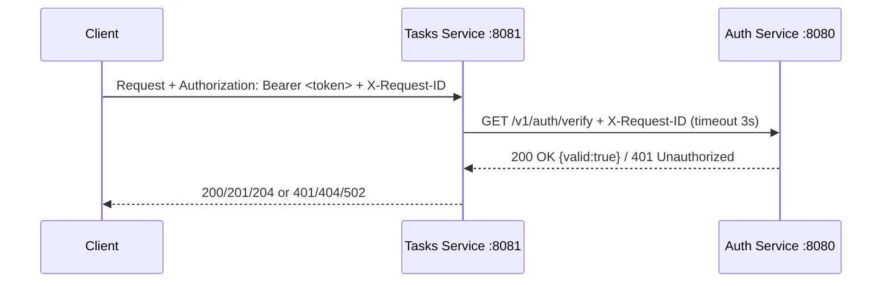

# Практическое занятие №1 — Разделение монолита на 2 микросервиса. Взимодействие через HTTP

**Дисциплина:** Технологии индустриального программирования  
**Преподаватель:** Адышкин Сергей Сергеевич  
**Семестр:** 2, 2025–2026 уч. год
**Подготовила:** Сорокина К.С., ЭФМО-01-25.

### Цель:
Научиться декомпозировать небольшую систему на два сервиса и организовать корректное синхронное взаимодействие по HTTP (с таймаутами, статусами ошибок и прокидыванием request-id).

### Получены следующие результаты:
•	выделены границы сервисов (зона ответственности);
•	реализованы API сервисов и их контракты;
•	выполнен межсервисный HTTP-вызов с таймаутом и обработкой ошибок;
•	прокинут correlation/request-id;
•	документируются эндпоинты и сценарии запуска.

### Структура проекта:
```
.
├── docs
│   └── pz17_api.md
├── go.mod
├── screenshots
│   ├── 401 запрос без токена.png
│   ├── tree.png
│   ├── запуск сервера 1.png
│   ├── запуск сервера 2.png
│   ├── объект задачи с id.png
│   ├── получение списка задач.png
│   ├── проверка токена.png
│   └── токен 8081.png
├── services
│   ├── auth
│   │   ├── cmd
│   │   │   └── auth
│   │   │       └── main.go
│   │   └── internal
│   │       ├── http
│   │       │   └── handler.go
│   │       └── service
│   │           └── service.go
│   └── tasks
│       ├── client
│       │   └── authclient
│       │       └── client.go
│       ├── cmd
│       │   └── tasks
│       │       └── main.go
│       └── internal
│           ├── http
│           │   └── handler.go
│           └── service
│               └── service.go
└── shared
    ├── httpx
    │   └── client.go
    └── middleware
        ├── logging.go
        └── requestid.go
```
### Запуск сервера и установка порта:


### Проверки через POSTMAN:


---


## 1. Описание границ сервисов

**Auth Service** отвечает исключительно за аутентификацию: принимает логин и пароль, выдаёт токен, проверяет его валидность. Сервис ничего не знает о задачах — его единственная функция ответить «токен валиден» или «нет».

**Tasks Service** управляет задачами (CRUD). Он не хранит информацию о пользователях и не проверяет токены самостоятельно. Перед каждой операцией Tasks обращается к Auth Service по HTTP, передаёт токен клиента и действует согласно ответу.

Такое разделение позволяет изменять логику авторизации независимо от логики задач и наоборот. Сервисы общаются только через чётко определённые HTTP-контракты.

---

## 2. Схема взаимодействия


**Описание шагов:**
1. Клиент отправляет запрос к Tasks Service с заголовками `Authorization: Bearer <token>` и `X-Request-ID`
2. Tasks, прежде чем выполнить операцию, вызывает `GET /v1/auth/verify` в Auth с таймаутом 3 секунды, прокидывая тот же `X-Request-ID`
3. Auth проверяет токен и возвращает `200 OK` или `401 Unauthorized`
4. Tasks выполняет операцию и возвращает результат, либо пробрасывает ошибку клиенту

---

## 3. Эндпоинты

### Auth Service — `http://localhost:8080`

#### POST /v1/auth/login
Получение токена доступа.

**Request:**
```json
{
  "username": "student",
  "password": "student"
}
```

**Response 200:**
```json
{
  "access_token": "demo-token",
  "token_type": "Bearer"
}
```

**Ошибки:** `400` — неверный формат, `401` — неверные учётные данные

---

#### GET /v1/auth/verify
Проверка токена. Вызывается Tasks Service перед каждой операцией.

**Headers:** `Authorization: Bearer demo-token`, `X-Request-ID: <uuid>`

**Response 200:**
```json
{ "valid": true, "subject": "student" }
```

**Response 401:**
```json
{ "valid": false, "error": "unauthorized" }
```

---

### Tasks Service — `http://localhost:8081`

Все запросы требуют заголовка `Authorization: Bearer <token>`.

| Метод  | Эндпоинт          | Статус      | Описание              |
|--------|-------------------|-------------|-----------------------|
| POST   | /v1/tasks         | 201 Created | Создать задачу        |
| GET    | /v1/tasks         | 200 OK      | Список всех задач     |
| GET    | /v1/tasks/{id}    | 200 / 404   | Получить задачу по ID |
| PATCH  | /v1/tasks/{id}    | 200 / 404   | Обновить задачу       |
| DELETE | /v1/tasks/{id}    | 204 / 404   | Удалить задачу        |

**Коды ошибок:**
- `400` — неверный формат данных
- `401` — токен отсутствует или невалиден
- `404` — задача не найдена
- `502` — Auth Service недоступен

---

## 4. Прокидывание X-Request-ID

Заголовок `X-Request-ID` передаётся клиентом, прокидывается Tasks → Auth и возвращается в ответных заголовках. Это позволяет связать логи обоих сервисов по одному запросу.

**Запрос:**
```bash
curl -i -X POST http://localhost:8081/v1/tasks \
  -H "Content-Type: application/json" \
  -H "Authorization: Bearer demo-token" \
  -H "X-Request-ID: req-003" \
  -d '{"title":"Do PZ1","description":"split services"}'
```

**Лог Auth Service:**
```
[auth] method=GET path=/v1/auth/verify request_id=req-003
```

**Лог Tasks Service:**
```
[tasks] method=POST path=/v1/tasks request_id=req-003
```

Оба лога содержат одинаковый `request_id=req-003` — корреляция работает корректно.

---

## 5. Инструкция запуска

### Терминал 1 — Auth Service
```bash
cd services/auth
AUTH_PORT=8080 go run ./cmd/auth
```

### Терминал 2 — Tasks Service
```bash
cd services/tasks
TASKS_PORT=8081 AUTH_BASE_URL=http://localhost:8080 go run ./cmd/tasks
```

### Терминал 3 — Проверка
```bash
# Получить токен
curl -s -X POST http://localhost:8080/v1/auth/login \
  -H "Content-Type: application/json" \
  -d '{"username":"student","password":"student"}'

# Создать задачу
curl -i -X POST http://localhost:8081/v1/tasks \
  -H "Content-Type: application/json" \
  -H "Authorization: Bearer demo-token" \
  -H "X-Request-ID: req-003" \
  -d '{"title":"Do PZ1","description":"split services","due_date":"2026-01-10"}'

# Получить список задач
curl -s http://localhost:8081/v1/tasks \
  -H "Authorization: Bearer demo-token"

# Проверить 401 (без токена)
curl -i http://localhost:8081/v1/tasks
```

---

## 6. Переменные окружения

| Сервис | Переменная    | По умолчанию           | Описание           |
|--------|---------------|------------------------|--------------------|
| Auth   | AUTH_PORT     | 8080                   | Порт Auth Service  |
| Tasks  | TASKS_PORT    | 8081                   | Порт Tasks Service |
| Tasks  | AUTH_BASE_URL | http://localhost:8080  | URL Auth Service   |


# API Documentation — PZ1

## Переменные окружения

| Сервис | Переменная | Дефолт |
|--------|-----------|--------|
| Auth | AUTH_PORT | 8081 |
| Tasks | TASKS_PORT | 8082 |
| Tasks | AUTH_BASE_URL | http://localhost:8081 |

## Auth Service (порт 8081)

### POST /v1/auth/login
Получение токена.
- **200** — `{"access_token": "demo-token", "token_type": "Bearer"}`
- **401** — неверные учётные данные

### GET /v1/auth/verify
Проверка токена. Заголовок: `Authorization: Bearer <token>`
- **200** — `{"valid": true, "subject": "student"}`
- **401** — токен невалиден

## Tasks Service (порт 8082)

Все запросы требуют заголовка `Authorization: Bearer <token>`.

### POST /v1/tasks — создать задачу (201)
### GET /v1/tasks — список задач (200)
### GET /v1/tasks/{id} — задача по ID (200/404)
### PATCH /v1/tasks/{id} — обновить задачу (200/404)
### DELETE /v1/tasks/{id} — удалить задачу (204/404)
